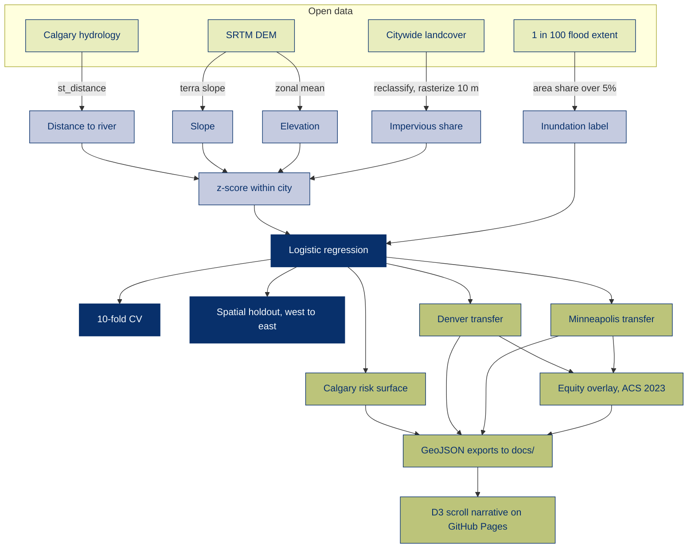

## A flood inundation probability model trained on Calgary and tested for transferability in Denver and Minneapolis

**Click to watch our [presentation video](https://www.youtube.com/watch?v=l8quCz-AnGw&t=4s)🎉 and we have [an interactive storytelling web](https://cyber-hbliu.github.io/flood-inundation-prediction/)**

Floods are one of the most devastating natural disasters, causing widespread damage to communities and infrastructure. This repository holds the final project for **UPENN CPLN 6750 Land Use and Environmental Modeling**. The analysis estimates, for every 500-meter grid cell, the probability that the area will be inundated with floodwater. A logistic regression is trained and validated on Calgary, Alberta, with the city's official 1 in 100 year flood extent as the label and four predictors built entirely from open data in R, distance to river, slope, elevation, and impervious share. 

The model is then used to predict for Denver and Minneapolis, two comparable cities chosen on a terrain gradient, to test what it learned and where its validity ends. It predicts well where terrain drives hydrology and degrades to a river buffer on flat ground. An equity overlay joins predicted risk to 2023 ACS poverty rates in both US cities.

## Workflow

## For Policy Making
From the city of Calgary, we can see that it faces the greatest risk of flooding during spring and summer. Calgary's 2013 flood displaced roughly 80,000 residents and remains the reference event for the city's flood planning. The Front Range of Colorado flooded the same year, with similar rainfall in the foothills. Additionally, heavy rainfall on the melting snowpack in the Rocky Mountains combined with steep, rocky terrain caused rapid and intense flooding in southern Alberta watersheds. Flooding disrupted businesses, damaged critical infrastructure, and caused power outages across Calgary. 

As a river city, it is important to prepare, respond, and adapt to floods. Every spring, the city of Calgary actively monitors the rivers for flooding. They continuously improve flood forecasting to provide citizens with the earliest possible warning. Therefore, the information from this analysis can be used by Calgary city planners to make informed decisions about land use, infrastructure development, and emergency preparedness. To deploy such an algorithm, we would first need to validate and refine the model using historical flood data and other relevant features. Once we have a model that fits well, we can use it to generate flood inundation maps for Calgary and comparable cities.

